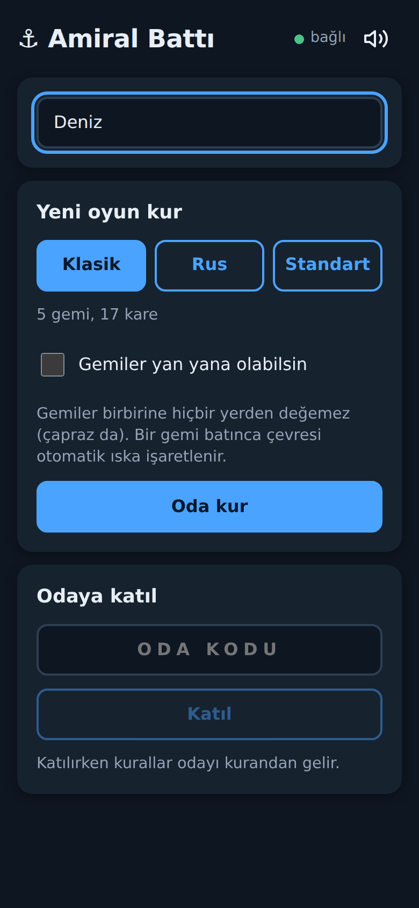
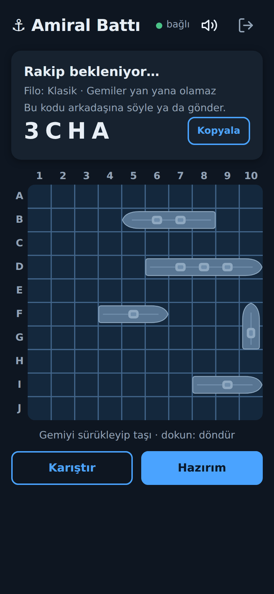
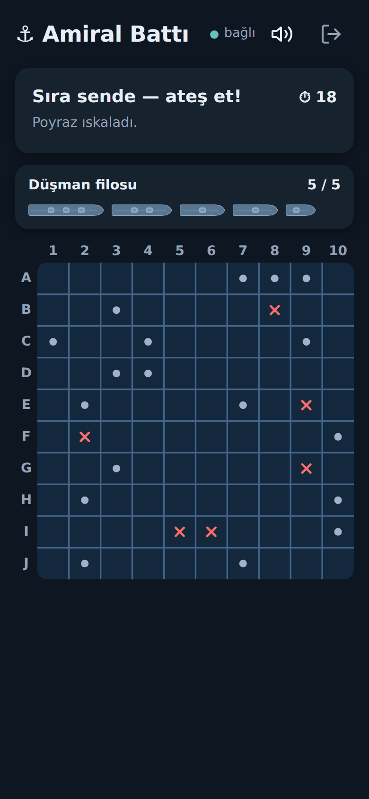
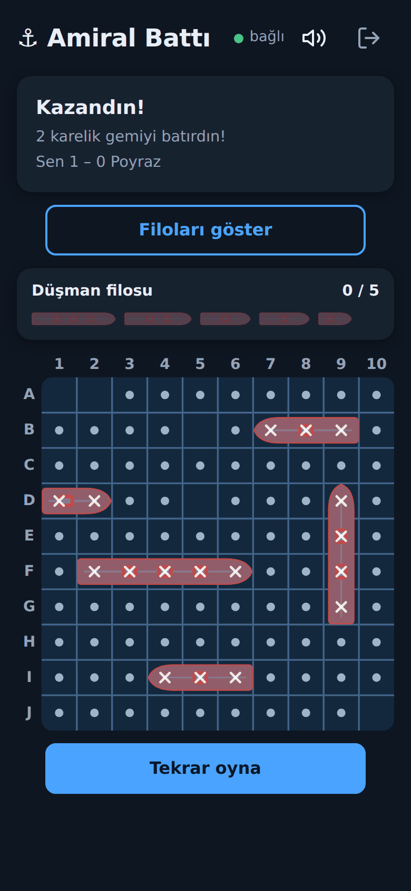
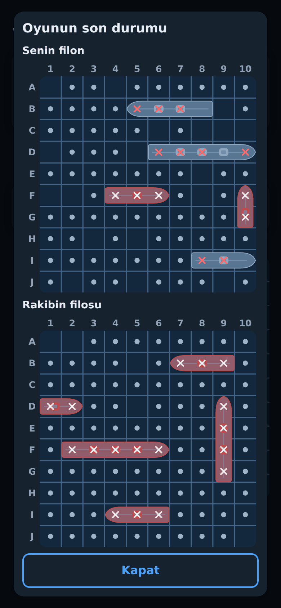
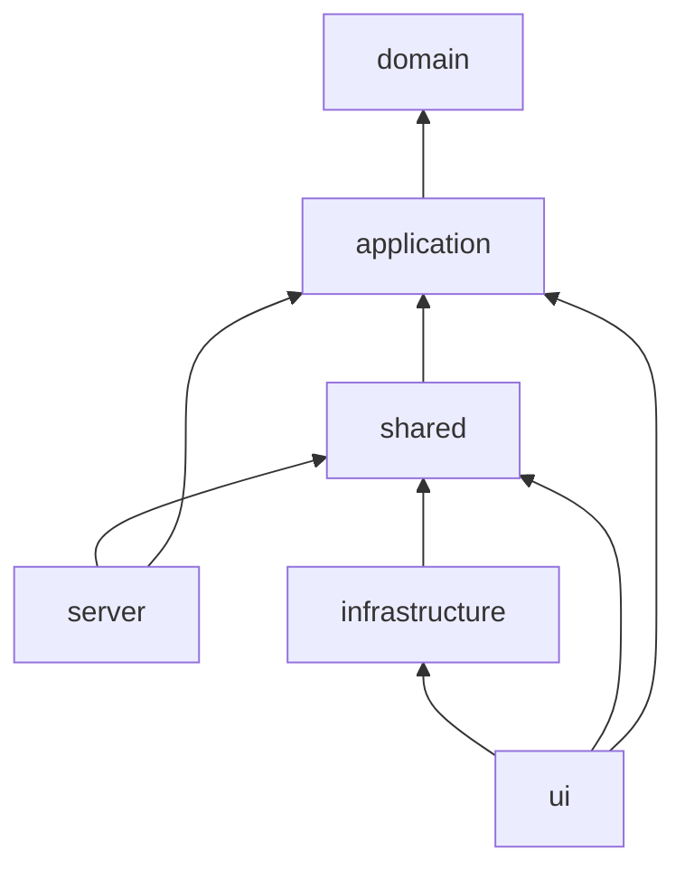

# ⚓ Amiral Battı

Online two-player Battleship for the browser. Create a room, send the code to a friend, and play from your phone or your computer.

**▶ Play it: <https://amiral-batti-0d6t.onrender.com>**
*(It runs on a free host: if nobody has played for a while, the first load takes about 30 seconds while the server wakes up. The interface is in Turkish.)*

<table>
  <tr>
    <td width="20%" align="center"><br><sub>Lobby</sub></td>
    <td width="20%" align="center"><br><sub>Room and placement</sub></td>
    <td width="20%" align="center"><br><sub>Battle</sub></td>
    <td width="20%" align="center"><br><sub>Game over</sub></td>
    <td width="20%" align="center"><br><sub>Both fleets</sub></td>
  </tr>
</table>

## Features

- **Rooms with a short code.** One player creates a room and shares its 4-character code; the other joins with it. The joining player sees the rules the room was created with.
- **Three fleets.** *Classic* (5 ships, 17 cells), *Russian* (ten ships from four cells down to one, which are never allowed to touch) and *Standard* (a mixed fleet with a T-shaped and a staggered ship).
- **Ships may touch, or not.** Off by default. When it is off, the water around a sunk ship is marked as empty for you.
- **Place your own fleet.** Drag ships with a finger or the mouse, tap one to turn it, or press shuffle. Ships that cannot stay where they are turn red.
- **A hit keeps your turn.** Keep firing until you miss. Each turn lasts 20 seconds; when the time is up the game fires at a random cell for you.
- **Rematch.** The score stays and the other player starts. After a game both fleets can be shown side by side.
- **Comes back after a refresh.** If the page reloads or the connection drops, the player returns to the same room.
- **Made for phones.** The game fits one screen without scrolling, follows the light or dark theme of the device, and has sound effects with an on/off switch. A ring shows which cell was just fired at.
- **No cheating from the browser.** The server decides everything. A browser only ever receives what its player is allowed to know; the opponent's ships are sent only once they have sunk, or all of them when the game is over.

## Run it on your computer

You need [Node.js](https://nodejs.org/) 22 or newer.

```bash
npm install
```

**While developing** (two terminals; Vite passes `/ws` on to the game server):

```bash
npm run dev:server   # the game server on port 3000, restarts when a file changes
npm run dev          # the site on http://localhost:5173
```

Restarting the server empties its rooms, because rooms are kept in memory.

**Like the real thing** (one process serves the built site and the WebSocket):

```bash
npm run build
npm run server       # http://localhost:3000, set PORT to use another port
```

**Tests and type check:**

```bash
npm test             # all tests, once
npm run build        # type check, then build
```

## How it is built

TypeScript all the way, with [Vite](https://vite.dev/) for the browser side, [ws](https://github.com/websockets/ws) for the WebSocket server and [Vitest](https://vitest.dev/) for the tests. The interface is plain DOM and SVG, with no UI framework.

```
src/
  domain/           the rules, with no input or output: board, ships, fleets, battle, turn timer
  application/      a game and a room built from the domain, and what each player may see of them
  shared/           the messages the browser and the server send each other
  server/           the WebSocket server and the static file server (Node)
  infrastructure/   the browser's connection to the server, and what it keeps in localStorage
  ui/               screens, the SVG board, drag and drop, sound, styles
tests/              the tests, in folders that mirror the ones in src/
```

Dependencies point inwards: the domain imports nothing, and everything else builds on it.



A few decisions worth knowing about:

- **The server is the referee.** The browser says "fire at B4"; the server checks it, changes the game and sends each player their own view of it.
- **Immutable game objects.** A shot, a placement or a rematch returns a new `Game` instead of changing the old one, so there is no hidden state to chase.
- **Time and chance are passed in.** The clock, the random source and the timers are injected, so the tests run in milliseconds and never depend on luck.
- **Words live in their own files.** Everything a player reads is in a `*Text.ts` file next to its screen; the rest of the code deals in codes, which keeps a later translation simple.
- **Tested.** More than 900 tests cover the rules, the server and the screens.

## Putting it online

One Node process is enough: it serves the built site and the WebSocket on the same port, and answers `/healthz` for health checks. On [Render](https://render.com/) as a free Web Service:

| Setting | Value |
| --- | --- |
| Build command | `npm install --include=dev && npm run build` |
| Start command | `npm run server` |
| Health check path | `/healthz` |

`tsx`, which runs the server, is a development dependency, hence `--include=dev`. The host sets `PORT` itself. Rooms live in memory, so a restart or a deploy ends the games in progress.

## Ideas for later

- A sinking effect when a ship goes down
- A computer opponent, to play when nobody else is around
